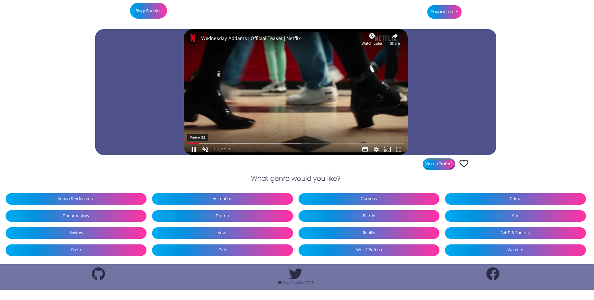
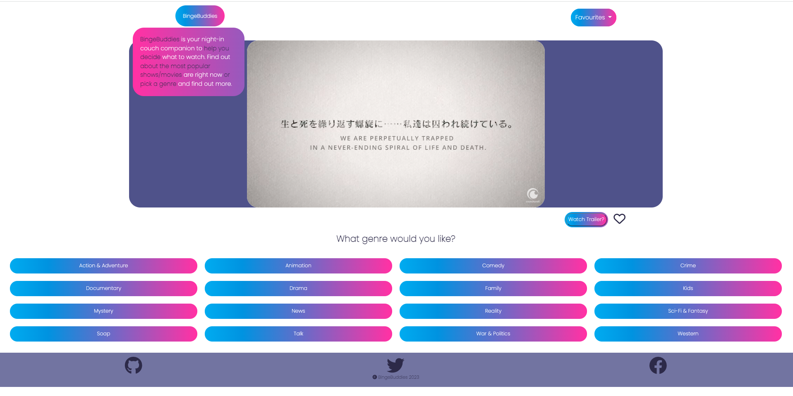
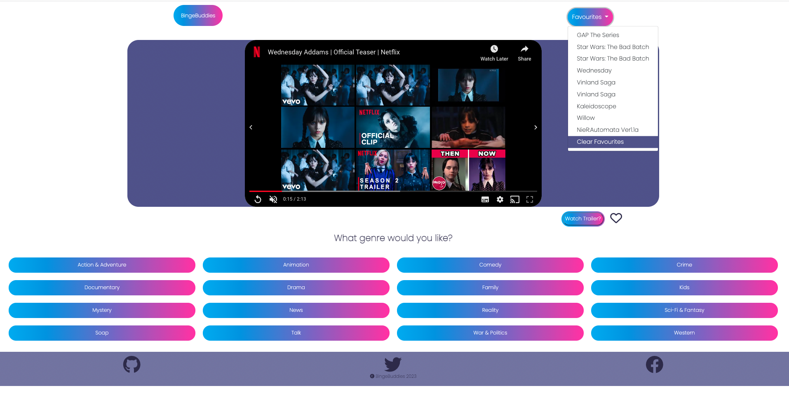
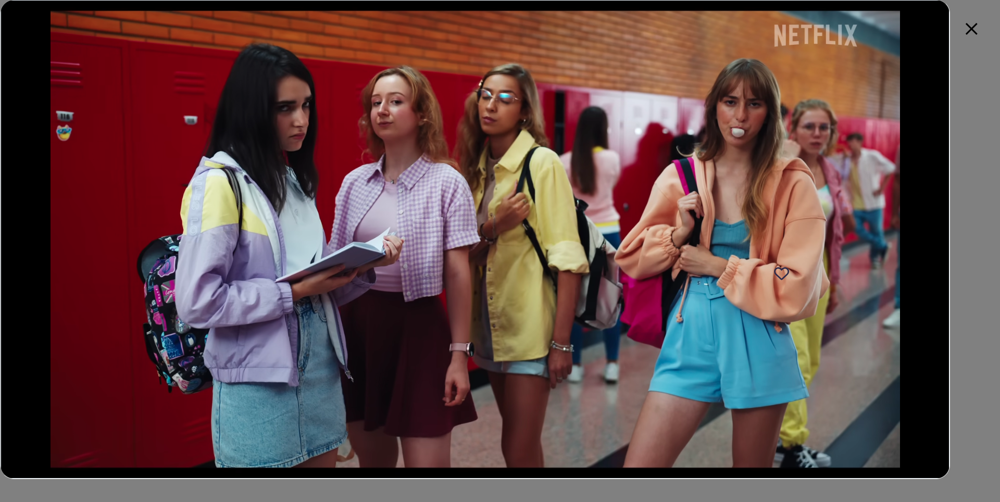

# BingeBuddies

## Description
BingeBuddies is the solution to your boredom, when in doubt about which TV show to watch visit BingeBuddies for the top picks of the day, but also options related to any particular genre.

## Usage
Top pick TV shows of the day are running for 7 seconds on the trailer screen. User can see full trailer by pressing "watch trailer" button. Also various genre categories are present to choose TV shows from. On pressing any category button will display list of the shows for that particular category.
On clicking the list item user can see the selected show's trailer on full screen.

## Screenshot

## Features

Random Top pick of the day TV show
Search according to the genres
Favourites list
Watch full trailer on full screen mode

## Installation

N/A 

## Credits

1. https://developers.google.com/youtube/v3 - With the YouTube Data API, you can add a variety of YouTube features to your application. Use the API to upload videos, manage playlists and subscriptions, update channel settings, and more.
2. https://www.themoviedb.org/ -The API service is for those of you interested in using movie, TV show or actor images and/or data in your application. The API is a system we provide for you and your team to programmatically fetch and use our data and/or images.

Github handles:
1. [sanjana-1604](https://github.com/sanjana-1604)
2. [sabrina-martorelli](https://github.com/sabrina-martorelli)
3. [nrai14](https://github.com/nrai14) 
4. [lauralp92](https://github.com/lauralp92)

## License

The MIT License (MIT)

Copyright (c) 2022 Sabrina Martorelli

Permission is hereby granted, free of charge, to any person obtaining a copy of this software and associated documentation files (the "Software"), to deal in the Software without restriction, including without limitation the rights to use, copy, modify, merge, publish, distribute, sublicense, and/or sell copies of the Software, and to permit persons to whom the Software is furnished to do so, subject to the following conditions:

The above copyright notice and this permission notice shall be included in all copies or substantial portions of the Software.

THE SOFTWARE IS PROVIDED "AS IS", WITHOUT WARRANTY OF ANY KIND, EXPRESS OR IMPLIED, INCLUDING BUT NOT LIMITED TO THE WARRANTIES OF MERCHANTABILITY, FITNESS FOR A PARTICULAR PURPOSE AND NONINFRINGEMENT. IN NO EVENT SHALL THE AUTHORS OR COPYRIGHT HOLDERS BE LIABLE FOR ANY CLAIM, DAMAGES OR OTHER LIABILITY, WHETHER IN AN ACTION OF CONTRACT, TORT OR OTHERWISE, ARISING FROM, OUT OF OR IN CONNECTION WITH THE SOFTWARE OR THE USE OR OTHER DEALINGS IN THE SOFTWARE.

## Deployed Link
https://sabrina-martorelli.github.io/BingeBuddies/
